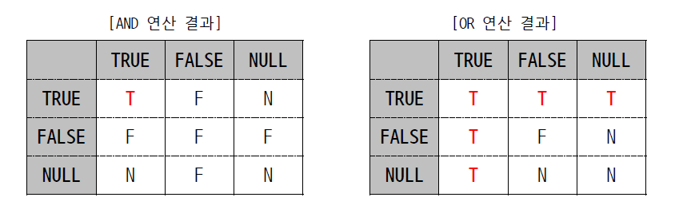

# SQL


## 기본 구문

```sql
SELECT	* | {[DISTINCT] {column_name | expr}} {[AS] [alias], ...}
FROM	table_name
WHERE	search_condition [{AND | OR}, search_condition ...]

/* []는 생략가능, {}는 세트 */
```

결과로 나오는 table 을 Result set 이라 부름  
구문의 끝은 `;` 나 `/` 로 표기  
`tab` 이용한 들여쓰기 꼭 할 것  

### SELECT

**조회할 col**   

- \* 붙이면 모든 col 출력

- 여러 col은 쉼표로 구분, 입력 순서대로 출력됨

- col에 대한 산술연산도 가능함
- `row data` AS `"col name"`  치면 row data로 채워친 col 생성되어 출력됨, 이 때 roe data를 '리터럴(literal)'이라 부름

#### DISTINCT

앞에 이거 붙이면 중복 제거됨  
여러개 col을 조회할 경우 col들의 조합결과를 기준으로 중복여부 판단  

#### AS

뒤에 이거 붙이면 col 이름 바꿀 수 있음(별칭 지정)  
특수문자나 소문자 들어가면 `"`로 묶어주기  
AS는 생략 가능함  

### FROM

**조회할 col이 포함된 table**  

### WHERE

**row를 선택하는 조건**  

- 없어도 됨

- AND, OR 로 조건식 연결


## 연산자(Operator)


### 연결 연산자(Concatenation Operator)

```sql
--col 예제
SELECT	COL1||COL2||COL3
--literal 예제
SELECT	COL1||'의 월급은'||COL2||'원 입니다.'
```

col과 literal 을 연결할 수 있음  


### 논리 연산자(Logical Operator)

```
AND OR NOT
```




### 비교 연산자(Comparison Operator)


표현식(expr)을 비교해서 논리결과(TRUE/FALSE/NULL)로 return  
col 이나 expr 간 data type이 동일해야함    

```sql
WHERE	SCORE BETWEEN 0 AND 100; /*0이상 100이하*/

WHERE	NAME NOT LIKE '김%'; /*김씨 아닌 사람*/
WHERE	주민번호 LIKE '______-1______' /*--남자만 조회*/

WHERE	PERCENT '__\%'
WHERE	PERCENT '__#%' ESCAPE '#'
```

#### 와일드 카드(Wild Card)

`%`: Percentage 0개 이상의 임의의 문자열 의미  
`_`: Underscore 해당 부분에 단 1개의 문자 의미  
`\`: Escape Option 와일드 카드 자체를 데이터로 처리해야 할 때 (eg. \%)  
`ESCAPE '@'`: Escape 문자는 이렇게 임의 지정 가능  

```sql
WHERE	NAME IS NOT NULL	/*이름 있으면서*/
AND		PHONE IS NULL;		/*폰번호 없는*/

/*60점 90점*/
WHERE	SCORE IN ('60', '90')

WHERE	SCORE = '60'
OR		SCORE = '90'
```


### 연산자 우선 순위


```sql
WHERE	(COL1 = '0'
OR      COL1 = '100')
AND		COL2 > 50;
```

되도록이면 `()` Parenthesis 사용하여 가독성 높일 것


## 함수(Function)


### 단일 행 함수(Single-Row Function)

**행 마다 적용되어 Output을 행의 개수 만큼 출력**


#### 문자열 함수

##### LENGTH / LENGTHB

**주어진 column이나 문자열 길이(Byte)를 반환하는 함수**

```sql
/*구문*/
SELECT LENGTH(COL)
/*retrun type*/
number
/*parameter*/

```

고정길이 CHAR 사용 자제할 것(안 쓰는 공간 낭비)

VARCHAR는 문자열 길이만큼 return

- CHAR type 에 한글이 포함되었을 경우

col 길이 - 데이터 길이 = 여유 공간

데이터 문자 갯수 + 여유 공간

ex. CHAR 한글은 할당길이-한글수*3바이트+문자열길이

20-6*3+6=8

(이해 잘 안 가니 추후 update 요망) //TODO

(문자당 바이트 수 추가 확인) //TODO

##### INSTR

**찾는 문자(열)이 나타난 시작 위치를 반환하는 함수**

```sql
INSTER(string, substring, [position, [occurrence]])

string: 대상 column 또는 문자열
subsring: 찾으려는 문자(열)
position: 양수면 시작 부터 끝(default), 음수면 끝부터 시작 쪽으로
occurrence: substring의 반복 빈도(default=1, 음수 사용불가)

SELECT	EMAIL,
		INSTR(EMAIL, 'c', -1, 2)
/* EMAIL 뒤에서부터 2번째 나오는 c의 위치 */

SELECT	EMAIL,
		INSTR(EMAIL, 'c', INSTR(EMAIL,'.')-1)
/* 첫 . 한 자리 앞에서 앞쪽으로 처음 나오는 c 찾기*/
```

##### LPAD / RPAD

**임의의 문자(열)을 양쪽에 덧붙이는 함수**

```sql
LPAD(string, N, [str])
RPAD(string, N, [str])
```


### 그룹 함수(Group Fuction)

**행의 집합에 적용되어 Output을 1개만 출력**


